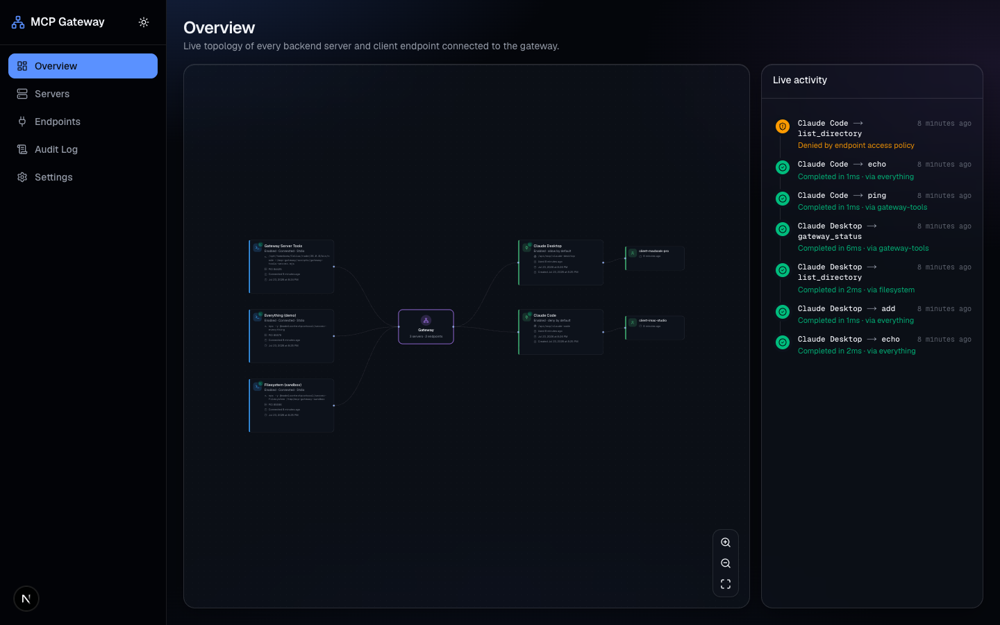
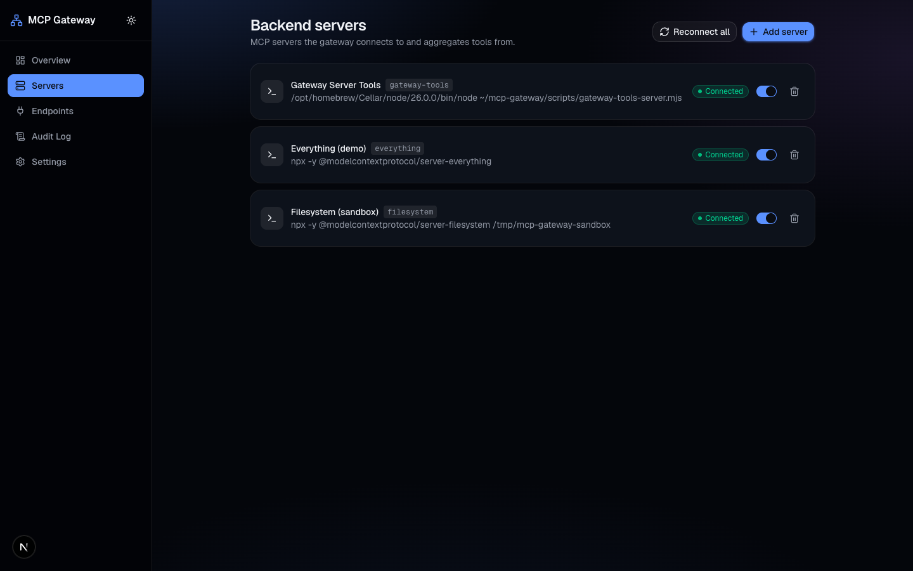
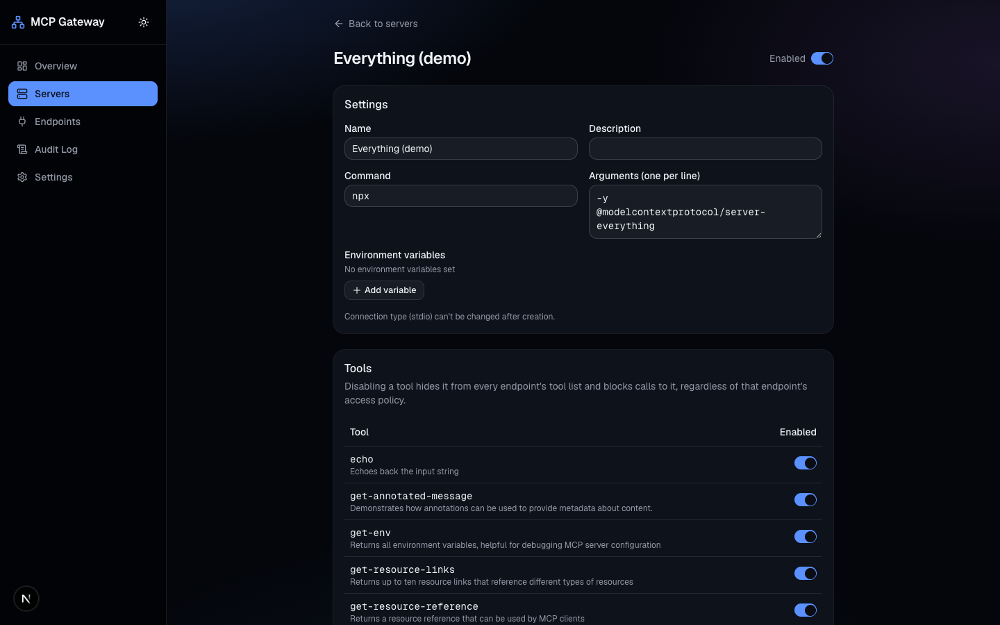
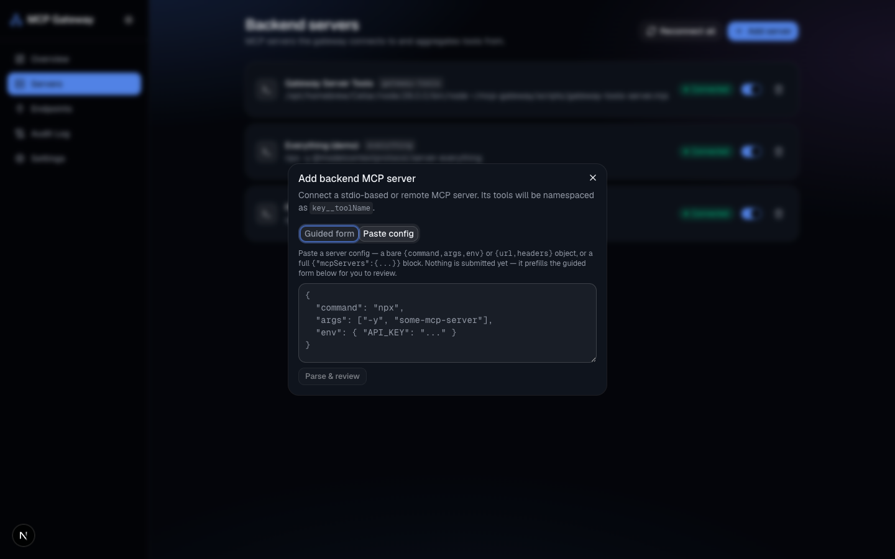
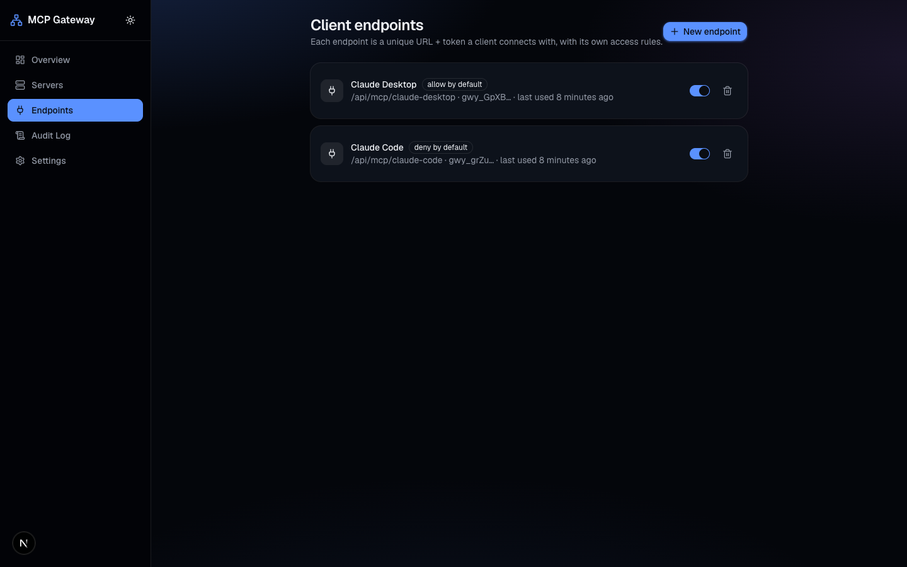
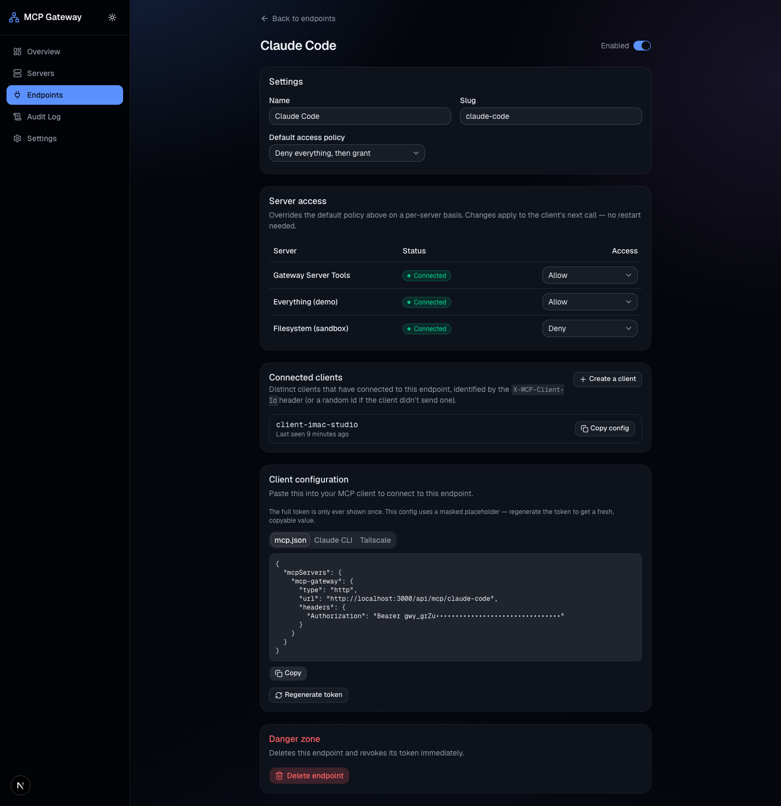
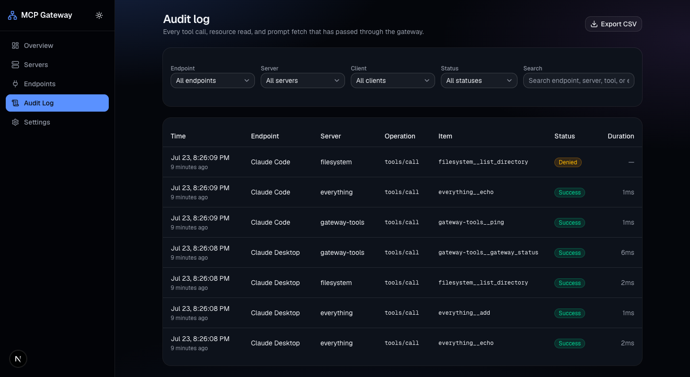

# MCP Gateway

A self-hosted dashboard for aggregating multiple [Model Context Protocol](https://modelcontextprotocol.io) (MCP) servers behind a single gateway — with per-client access control, a live network diagram, and a full audit trail.

Point Claude Desktop, Claude Code, or any other MCP client at one gateway URL instead of configuring each backend server individually. Namespaced tools (`server__tool`) from every connected backend show up as one unified toolset, with fine-grained control over which client can use which server.



## Features

- **Backend server management** — connect stdio (local command), Streamable HTTP, or SSE MCP servers from the dashboard; live connection status with auto-reconnect for remote servers.
- **Client endpoints** — create as many unique URL + token pairs as you need, each with its own default access policy (allow-all-then-restrict, or deny-all-then-grant) and per-server overrides.
- **Live network diagram** — the homepage shows every backend server and client endpoint as a live topology graph, with animated pulses on the edges as tool calls flow through in real time.
- **Full audit log** — every tool call, resource read, and prompt fetch is logged (including denials), filterable by endpoint/server/status/name, with CSV export.
- **Copy-paste client config** — each endpoint's settings page generates the ready-to-use `mcpServers` JSON block (and the equivalent `claude mcp add` command) with the endpoint's own URL and token.

## Screenshots

<details>
<summary><strong>Backend servers</strong> — connection status, one-click reconnect, per-tool kill switch</summary>



Every backend server shows its live connection status and a **Reconnect all** action. Opening a server exposes its full tool list with an individual enable/disable switch per tool — a disabled tool disappears from every endpoint's tool list and is blocked from being called, regardless of that endpoint's access policy.



</details>

<details>
<summary><strong>Adding a server</strong> — guided form, or paste an existing config</summary>

Already have a working MCP config for another client? Paste it directly and the guided form gets pre-filled for review — no manual re-typing of commands, env vars, or headers.



</details>

<details>
<summary><strong>Client endpoints</strong> — per-server access rules, connected clients, ready-to-copy config</summary>



Each endpoint gets its own default policy (allow-all-then-restrict, or deny-all-then-grant) plus per-server overrides, a list of the distinct clients that have connected to it, and a client-config panel that's always ready to paste — the server entry name is always the fixed `mcp-gateway`, so renaming an endpoint never breaks an already-configured client.



</details>

<details>
<summary><strong>Audit log</strong> — every call, every denial, filterable and exportable</summary>



Every tool call is logged with exact and relative timestamps, duration, and outcome — including calls blocked by access policy, so a "why didn't this work" question always has an answer in the log instead of just in a client-side error.

</details>

## Quickstart

Run it directly, no clone needed — this builds and starts it from wherever you run the command:

```bash
npx @lloyd-aloysius/mcp-gateway
# or straight from GitHub, no npm needed:
npx github:lloyd-aloysius/mcp-gateway
```

Prefer a persistent install over `npx` re-fetching each time?

```bash
npm install -g @lloyd-aloysius/mcp-gateway
mcp-gateway
```

Or clone it if you want to poke at the source:

```bash
git clone <this-repo>
cd mcp-gateway
npm install
npm run dev
```

Either way, open [http://localhost:3000](http://localhost:3000). The SQLite database is created automatically in `./data/gateway.db` (relative to wherever you ran the command) on first run — no setup step required.

Add a backend server from the **Servers** page (e.g. `npx -y @modelcontextprotocol/server-everything` as a stdio server), then create a **client endpoint** and copy its config into your MCP client.

## Architecture

Everything runs in a single Next.js process:

- The dashboard UI and admin API (`/api/servers`, `/api/endpoints`, `/api/audit`, …) are ordinary Next.js pages and Route Handlers.
- The gateway itself is `/api/mcp/[slug]/route.ts` — one Route Handler per client endpoint, built on the MCP TypeScript SDK's `WebStandardStreamableHTTPServerTransport` (Fetch API-native, so no custom server is needed).
- Backend server connections (stdio child processes / remote HTTP or SSE clients) are held as in-process singletons, bootstrapped once at boot via `instrumentation.ts`.
- A `/api/events/stream` Server-Sent Events endpoint pushes real-time updates (connection status, tool calls, audit entries) to the dashboard — this is what drives the live diagram and activity feed.
- SQLite (via Drizzle ORM) stores backend server configs, client endpoints, access rules, and the audit log.

Because it holds live child processes and open SSE connections, this needs a **persistent, long-running process** — a VPS, a Docker container, or your own machine — not a serverless platform.

## Access control

Each client endpoint has a **default policy**:

- **Deny everything, then grant** — the endpoint sees no tools until you explicitly allow specific servers.
- **Allow everything, then restrict** — the endpoint sees every connected server's tools unless you explicitly deny one.

Per-server rules on the endpoint's settings page override the default for that server. Rule changes apply on the client's *next* call — no gateway restart required (though the client's own cached tool list may lag until it re-lists, which is normal MCP client behavior, not a gateway bug).

## Configuration

Copy `.env.example` to `.env` to override defaults:

| Variable | Default | Purpose |
|---|---|---|
| `DATABASE_PATH` | `./data/gateway.db` | Where the SQLite file lives |
| `PORT` | `3000` | Port `npm start` binds to |
| `HOST` | `127.0.0.1` | Host `npm start` binds to |

## Security notes

There is **no login on this dashboard** — it's designed for personal, single-user, self-hosted use, not multi-tenant deployment. Anyone who can reach the dashboard's URL can manage servers, endpoints, and tokens. Keep it bound to `127.0.0.1` (the default) or behind your own firewall/VPN/SSH tunnel if you need remote access — the Settings page shows a warning if it detects it's being accessed from somewhere other than localhost.

Client endpoint tokens are stored as SHA-256 hashes, never in plaintext — a token is shown once at creation (or after a regeneration) and cannot be retrieved again afterward.

Found an actual security issue? Please see [SECURITY.md](SECURITY.md) for how to report it privately rather than opening a public issue.

## Tech stack

Next.js (App Router) · TypeScript · `@modelcontextprotocol/sdk` · Drizzle ORM + SQLite · Tailwind CSS + shadcn/ui · React Flow · Server-Sent Events

## Roadmap / not in v1

Multi-user auth, dashboard login, per-tool (rather than per-server) access granularity, OAuth passthrough for authenticated remote backends, hot-reloading config without a restart, scheduled/emailed audit reports.

## Contributing

Contributions are welcome — bug reports, feature ideas, and pull requests
alike. See [CONTRIBUTING.md](CONTRIBUTING.md) for dev setup, coding
conventions, and the PR checklist. Everyone participating is expected to
follow the [Code of Conduct](CODE_OF_CONDUCT.md).

## License

MIT — see [LICENSE](LICENSE).
